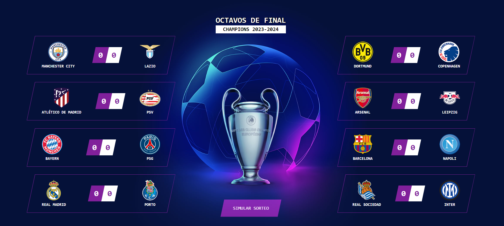

# Champions League - Random matches generator

This is an react.js application to generate UEFA Champions League matches, with results based on the current form of each team

### Screenshot

### Links

- Live Site URL: [https://champions-match-generator.netlify.app/](https://champions-match-generator.netlify.app/)

## Note

This is for educational and entertainment purposes, all rights reserved belong to [UEFA](https://www.uefa.com/).

## Author

- Website - [Samuel Figueroa](https://sfweb.netlify.app/)
