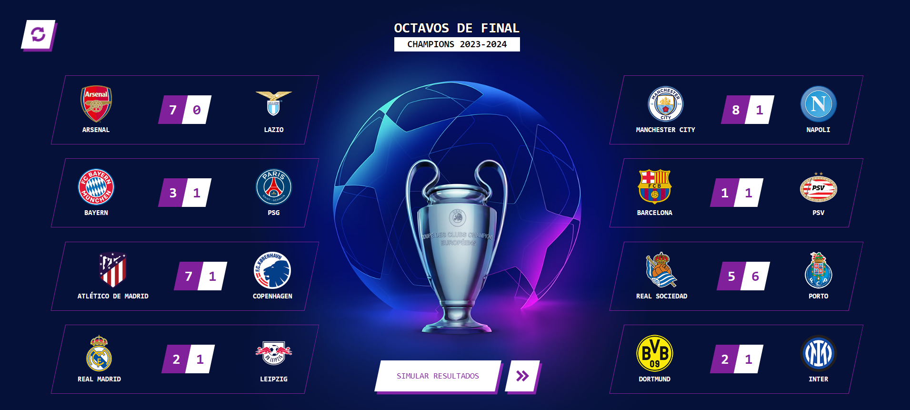

# Champions League - Random matches generator

This is an react.js application to generate UEFA Champions League matches, with results based on the current form of each team

### Screenshot

### Links

- Solution URL: [https://www.frontendmentor.io/solutions/ecommerce-product-page-with-react-and-tailwind-7UL7fz7tcg](https://www.frontendmentor.io/solutions/ecommerce-product-page-with-react-and-tailwind-7UL7fz7tcg)
- Live Site URL: [https://polite-crepe-fdbcd1.netlify.app/](https://polite-crepe-fdbcd1.netlify.app/)

## Note

This is for educational and entertainment purposes, all rights reserved belong to [UEFA](https://www.uefa.com/).

## Author

- Website - [Samuel Figueroa](https://sfweb.netlify.app/)
